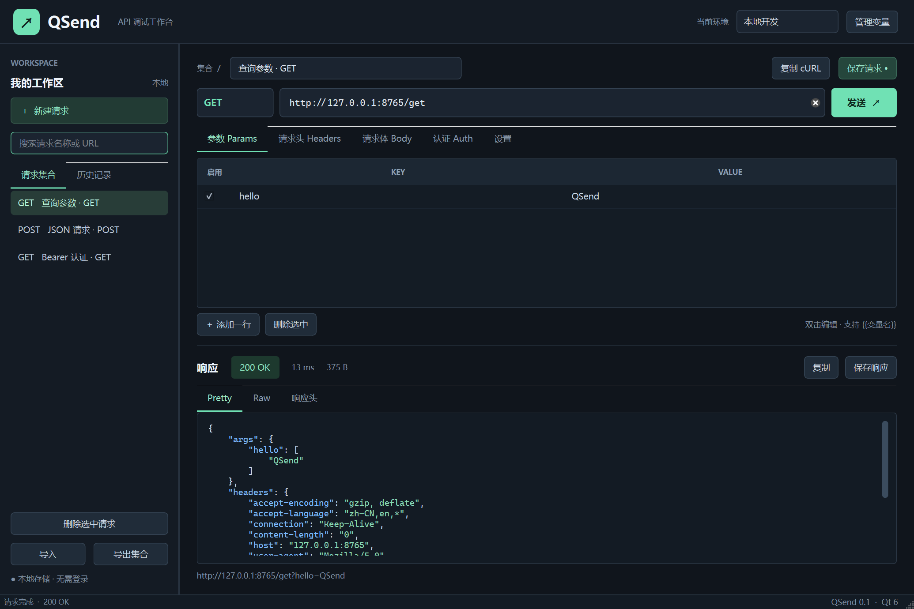

# QSend

[](https://github.com/wangchaozhi/QSend/actions/workflows/ci-release.yml)

基于 **Qt 6 + C++17** 的桌面 HTTP API 调试工具，用于完成 Postman 常见的日常请求调试工作。界面采用 Qt Widgets，网络请求使用 Qt Network，项目使用 CMake 构建。

这是一个可继续扩展的 MVP，当前重点是 HTTP 请求、响应检查、本地集合与环境管理。

**[开发路线规划](ROADMAP.md)**：从当前首版逐步建设多请求工作台、Postman v2.1/v3.0 迁移、脚本与自动化、接口规范、多协议和团队协作。文档包含阶段排期、Qt/C++ 架构、首轮任务及验收门禁；规划能力不代表当前已实现。



本次交付已经在 Windows x64 编译运行，18 个功能测试通过，包含本地 HTTP 与公开 HTTPS 实测。见 [验证记录](TEST_REPORT.md)。

## 下载与运行

在 [GitHub Releases](https://github.com/wangchaozhi/QSend/releases) 下载对应平台：Windows x64 解压运行 `QSend.exe`；macOS Universal 运行 `QSend.app`；Linux x64 解压运行 `./run-qsend.sh`。请保留包内依赖文件，桌面应用无需安装 Qt。

推送与 CMake 版本一致的 `vX.Y.Z` 标签会触发三端构建、测试、部署验证与自动发布。架构、系统依赖、签名限制、下载校验和操作步骤见 [发布说明](docs/RELEASING.md)。

需要离线演示时，在源码目录运行 `python scripts/run-demo-server.py`，然后在应用中导入 `examples/local-demo.postman_collection.json`，即可测试本地 GET、JSON POST、404 和取消请求。服务只监听 `127.0.0.1:8765`，使用 Ctrl+C 结束。Python 只用于这个可选演示服务；桌面应用本身是原生 C++ 程序。

## 功能

- 常见 HTTP 方法与自定义方法；可启用、禁用的查询参数和请求头。
- 无请求体、JSON、纯文本、`application/x-www-form-urlencoded` 四种请求体。
- Bearer Token、Basic Auth，以及 `{{variable}}` 环境变量替换。
- 异步请求、超时设置、取消请求；可选择自动跟随同源重定向，最多 10 次。
- 状态码、耗时、响应大小、响应头、原始响应和 JSON 格式化查看。
- 本地保存的请求集合、历史记录、多个环境；导入与导出 Postman v2.1 Collection JSON。
- 复制 cURL 命令、复制响应、将响应保存到文件。

响应最大保留 **10 MiB**；超出时停止接收并明确显示截断提示。HTTP 4xx/5xx 的响应体仍可检查。自动跳转限定同源（协议、主机、端口相同）；跨源重定向会被阻止并保留提示。

## 构建

依赖：CMake 3.21+、支持 C++17 的编译器、Qt 6.5+ 的 **Widgets / Network** 模块。启用测试还需要 **Qt Test**。Windows 下 Qt 包与编译器必须匹配，例如 MSVC 2022 x64 配合 `msvc2022_64` Qt。

在 Qt Creator 中打开 `CMakeLists.txt` 并选择对应 Qt 6 Kit，即可构建和运行。

Windows 也可在源码目录使用构建脚本，它会查找 MSVC、CMake 与 Ninja：

```powershell
.\scripts\build-windows.ps1 -QtPath C:\Qt\6.8.3\msvc2022_64 -DeployDir .\dist
```

命令行也可以使用 Qt 安装目录作为 `CMAKE_PREFIX_PATH`：

```sh
cmake -S . -B build -DCMAKE_PREFIX_PATH="<Qt 安装目录>/<版本>/<工具链目录>" -DBUILD_TESTING=ON
cmake --build build --config Release --parallel
ctest --test-dir build -C Release --output-on-failure
```

也可以将第一条命令中的 `CMAKE_PREFIX_PATH` 换为：

```sh
-DQt6_DIR="<Qt 安装目录>/<版本>/<工具链目录>/lib/cmake/Qt6"
```

Linux / macOS 的单配置生成器建议在配置时增加 `-DCMAKE_BUILD_TYPE=Release`。Windows 的完整示例，在 **x64 Native Tools Command Prompt for VS 2022** 中执行：

```bat
cmake -S . -B build -G "Visual Studio 17 2022" -A x64 -DCMAKE_PREFIX_PATH="C:/Qt/6.8.3/msvc2022_64" -DBUILD_TESTING=ON
cmake --build build --config Release --parallel
set "PATH=C:\Qt\6.8.3\msvc2022_64\bin;%PATH%"
ctest --test-dir build -C Release --output-on-failure
build\Release\QSend.exe
```

Ninja / Makefile 等单配置生成器通常输出 `build/QSend`，Windows 则为 `build/QSend.exe`；macOS 为 `build/QSend.app`。测试和运行时需要可找到对应 Qt 动态库与平台插件。只构建应用时可以使用 `-DBUILD_TESTING=OFF`。

将 Windows 应用复制到单独目录后，可以使用该 Qt 安装中的 `windeployqt` 收集运行依赖：

```bat
mkdir dist
copy build\Release\QSend.exe dist\QSend.exe
C:\Qt\6.8.3\msvc2022_64\bin\windeployqt.exe --release dist\QSend.exe
```

## 使用

1. 新建请求，输入名称、HTTP 方法及完整的 `http://` 或 `https://` URL。
2. 在 Params / Headers 中添加键值对；取消勾选可以保留但不发送该行。
3. 在 Body 中选择请求体类型，在 Auth 中选择认证方式，然后发送请求。
4. 保存请求后，可从左侧集合重新打开；历史记录可用于恢复之前发送的请求。

环境变量使用双花括号。例如在当前环境中配置 `baseUrl = http://localhost:8080`、`token = your-token` 后，可以写：

```text
URL:   {{baseUrl}}/api/users
Token: {{token}}
```

变量可用于 URL、参数、请求头、请求体以及认证信息；未定义的已使用变量会在发送前报错。停用的变量不参与替换；停用的参数与请求头不参与发送。

Form 请求体按**每行 `key=value`** 输入，工具会自动按 UTF-8 编码为空格使用 `+` 的表单格式。每行第一个 `=` 分隔键和值，支持空值和重复键；不要自行将整段内容预编码为 `a=1&b=2`。

```text
name=张三
message=hello world&more
empty=
tag=one
tag=two
```

Params 表格同样输入原始字符，工具负责 URL 编码。URL 输入框已有的查询参数会保留，并追加启用的 Params 行。

cURL 导出使用 **POSIX shell** 引号，适合 Bash / zsh / Git Bash；不保证可直接粘贴到 Windows CMD / PowerShell。导出命令包含实际替换后的认证信息。由于 cURL 的跨源跳转策略与此工具不同，导出命令不自动添加 `-L`。

## 数据与兼容范围

集合、请求历史、环境变量和已保存的认证信息存储在 Qt `QStandardPaths::AppDataLocation` 指定的应用数据目录中的 `workspace.json`，以本地 JSON **明文保存，不加密**。历史保存请求配置与执行摘要；不保存响应体。工作区使用原子写入；读取损坏文件会报告错误。

Windows 默认位置为 `%APPDATA%\QSend\QSend\workspace.json`。可以用 `QSend.exe --workspace path/to/workspace.json` 指定独立工作区。快捷键：Ctrl+Enter 发送、Ctrl+S 保存、Ctrl+N 新建。预览窗口最多显示响应的前 1 MiB；保存响应会写出全部已接收的数据（最多 10 MiB）。

Postman 导入支持嵌套文件夹，并将请求名称展开为 `文件夹 / 请求`。支持查询参数、请求头、原始 JSON / 文本、urlencoded 表单、Bearer / Basic 请求认证。导出的文件采用 Postman Collection v2.1 格式；附加 QSend 字段用于保留本工具的超时和跳转等配置。

当前不包含 WebSocket、gRPC、JavaScript 预请求脚本 / 断言、云同步、OAuth 授权流程、multipart 文件上传、证书管理或自动 Cookie 会话管理。Postman 的这些高级配置不会等价迁移。QSend 当前同时发送一个请求；未做 Postman 全量兼容承诺。

## 代码结构

```text
src/
  main.cpp                  应用入口
  core/
    models.*                请求、响应、工作区模型与变量替换
    requestengine.*         请求组装、异步网络、取消与超时、cURL 导出
    workspacestore.*        JSON 持久化与 Postman Collection 导入导出
  ui/
    mainwindow.*            主窗口、请求编辑器、响应查看器
    keyvaluetable.*         可启停的键值表格
    jsonhighlighter.*       JSON 语法高亮
    theme.h                界面样式
tests/
  core_tests.cpp            本地 HTTP 对端与持久化测试
  ui_tests.cpp              界面流程测试
```

核心网络测试使用本地 `QTcpServer`，不依赖外网服务，检查实际发送的 JSON、URL 编码、认证与表单数据，并覆盖 HTTP 错误响应、超时、取消、重定向、响应截断、持久化与集合往返转换。执行结果以当前构建的 `ctest` 输出为准。

## 许可

QSend 项目代码采用 [MIT License](LICENSE)。Qt 及其他第三方组件遵循各自许可；分发时须满足所使用 Qt 发行版和模块的许可条件。
