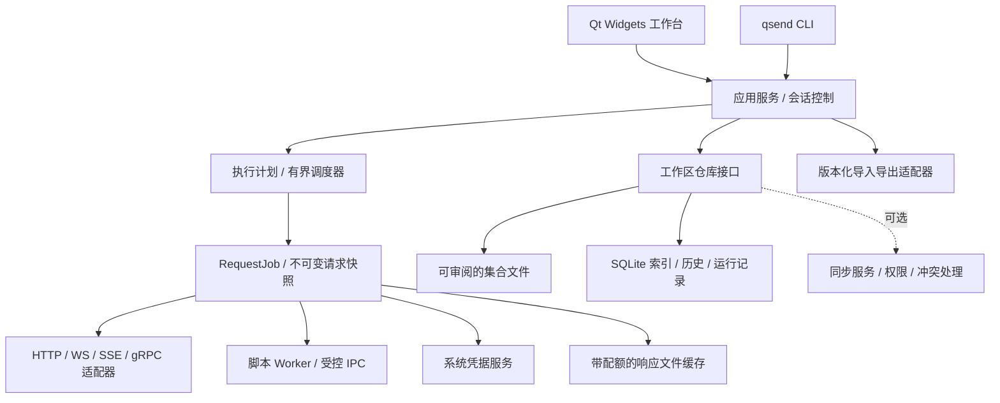

# QSend 开发路线规划：从 HTTP 调试首版到专业 API 工作台

版本：规划 v1.0 · 更新日期：2026-09-26 · 当前产品基线：QSend 0.1.0

本文是后续开发计划。除“当前基线”明确列出的能力外，以下目标、模块、命令、指标和版本均尚未实现，排期也不是交付承诺。

## 1. 产品目标与“媲美 Postman”的判定

QSend 的目标是以 **Qt 6 + C++** 构建一个适合个人开发者和研发团队长期使用的 API 工作台：请求调试可靠、集合迁移可解释、自动化结果可复现、敏感数据边界清楚，并提供 Windows、macOS、Linux 原生桌面体验。

竞争目标按三个层次推进：

| 层次 | 用户实际能完成的工作 | 对应版本目标 |
| --- | --- | --- |
| 日常调试替代 | 导入项目集合，切换环境，调试登录、文件上传、代理、证书和多请求流程，无需反复返回原工具 | v0.4 |
| 专业开发与测试替代 | 前后置脚本、数据驱动集合执行、命令行与 CI、接口规范、Mock、常用实时协议形成完整流程 | v1.0 |
| 团队平台能力 | 多人协作、共享工作区、权限、同步冲突处理、私有执行节点、监控和审计 | v1.5–v2.x |

**发布判断基于约定工作流的验收结果，不以功能菜单数量或未经验证的“覆盖 90% Postman 功能”作为宣传依据。** v1.0 也不等于 Postman 企业平台全量兼容。

首批目标用户是使用 REST/JSON、OAuth 2.0、GraphQL、WebSocket 和自动化回归测试的后端开发、测试工程师与小型团队。MQTT、Socket.IO、企业 SSO、治理规则和 AI 辅助有明确后续位置，不能挤占基础可靠性的交付资源。

### 1.1 对标基准及需要纠正的认知

截至本次查阅，Postman 的客户端已覆盖 HTTP、GraphQL、gRPC、WebSocket 和 MQTT，并提供脚本化请求流程。因此仅增加 HTTP 方法和漂亮界面不足以构成专业替代。[官方 API Client 说明](https://www.postman.com/product/api-client/)

Postman 当前文档将 **Collection schema 3.0.0** 描述为多文件 YAML 格式；Newman 可运行导出的 2.1.0 集合，但不能运行 3.0 集合。QSend 不能把现有 v2.1 JSON 导入当作对当前 Postman 的完整迁移能力。[官方集合格式说明](https://learning.postman.com/docs/use/use-collections/collections-schemas)

Postman 已支持 Native Git 和本地项目模式。QSend 的优势应通过启动速度、离线流程、数据控制、迁移质量和成本透明度证明，不将“本地使用”或“Git 管理”称为独有功能。[官方 Native Git 说明](https://learning.postman.com/docs/use/native-git/setup)

## 2. 当前基线：已经具备什么，缺口在哪里

证据以本仓库源码和 [验证记录](TEST_REPORT.md) 为准。当前有 15 个核心功能测试和 3 个界面功能测试；已验证 Windows x64 构建、打包、本地 HTTP 和公开 HTTPS。其他系统尚未经过发布验证。

| 能力 | 0.1.0 状态 | 当前边界 / 下一步 |
| --- | --- | --- |
| HTTP/HTTPS、标准与自定义方法 | 已实现 | 同一时间只能执行一个请求；HEAD 单独处理 |
| Query、Header、JSON、文本、urlencoded | 已实现 | 无 multipart、文件流上传和专用 XML 编辑器 |
| Basic / Bearer、环境变量 | 已实现 | 单个环境作用域、单次文本替换；无完整继承链和 OAuth 流程 |
| 响应内容、响应头、状态与耗时 | 已实现 | 内存最多保留 10 MiB，预览 1 MiB；JSON 解析仍在界面线程 |
| 超时、取消、重定向 | 已实现 | 仅自动跟随同源重定向，缺少连接 / 首字节 / 总时间的分段诊断 |
| 本地集合与历史 | 基础实现 | 请求列表扁平；整个工作区以 JSON 写入，上限 20 MiB，历史最多 100 条 |
| 数据保护 | 部分实现 | 已有原子写入与损坏文件保护；凭据、变量、历史仍为明文，无多实例写入锁 |
| Postman v2.1 导入导出 | 部分实现 | 文件夹名称被展开；部分认证继承可转换；脚本、集合变量、示例等尚不完整，缺少逐字段降级报告 |
| cURL | 单向导出 | POSIX shell 格式；没有导入；自动跳转行为与应用有明确差异 |
| 多标签、树形集合、工作区切换 | 未实现 | 需要先建立独立的会话与集合模型 |
| Cookie、代理、客户端证书、OAuth | 未实现 | 属于日常替代的必要能力 |
| 脚本、断言、Runner、CLI、报告 | 未实现 | 尚无执行计划与脚本隔离模型 |
| OpenAPI、Mock、实时协议 | 未实现 | 演示 echo 服务不是产品级 Mock Server |
| 跨平台发布、协作、云同步 | 未实现 | CMake 源码可移植性不等于各平台已经可交付 |

**近期最高优先级是可信存储、导入不静默丢失语义、请求执行解耦和凭据处理。** 先解决这些基础问题，再扩大协议和功能范围。

## 3. 能力矩阵与交付顺序

P0 表示当前阶段的发布阻断项；P1 表示核心交付范围；P2 表示满足前置条件后推进。优先级不代表所有事项可以同时开工。

| 领域 | 计划能力 | 优先级 | 首次交付目标 | 完成标准摘要 |
| --- | --- | --- | --- | --- |
| 数据可靠性 | schema 迁移、备份恢复、文件锁、损坏恢复入口 | P0 | v0.2 | 故障注入不丢失已提交数据，多实例不静默覆盖 |
| 敏感信息 | secret 引用、凭据库、日志/导出脱敏、历史清理 | P0 | v0.2–v0.3 | 导出的安全模式和 Git 文件不含秘密值 |
| 工作台 | 多标签、草稿、树形集合、搜索、撤销、快捷键 | P1 | v0.3 | 多请求状态独立，关闭/崩溃恢复不串数据 |
| HTTP 完整性 | multipart、二进制、流式文件、Cookie、代理、mTLS | P1 | v0.4 | 本地夹具验证请求字节、证书失败、取消和文件完整性 |
| 认证 | API Key 编辑器、OAuth 2.0 PKCE / client credentials、刷新 | P1 | v0.4 | 无浏览器内嵌密码收集，刷新并发受控，拒绝非法回调 |
| 变量体系 | global / collection / environment / data / local、secret 解析 | P1 | v0.3–v0.5 | 作用域优先级和运行快照可解释，有循环/缺失报告 |
| 迁移 | v2.1、环境文件、cURL 导入；v3.0 目录格式 | P0/P1 | v0.2 报告、v0.4 适配 | 支持范围内语义等价，未支持项有路径与处理建议 |
| 脚本 | 前置/后置 JS、常用 `pm.*` 子集、测试断言 | P1 | v0.5 | 超时/超内存/崩溃不拖死主程序，不支持 API 明确报错 |
| 自动化 | Runner、CSV/JSON 数据集、CLI、JUnit/JSON 报告 | P1 | v0.5 | GUI/CLI 同样输入得到同样断言结果，退出码稳定 |
| API 设计 | OpenAPI 3.0/3.1 导入、校验、变更比较、文档生成 | P1 | v0.6 | `$ref`、鉴权、示例、必填项测试通过，未知项不丢失 |
| Mock | 本地匹配规则、示例、延迟、异常、运行日志 | P1 | v0.6 | 默认仅监听回环地址，规则优先级和冲突可解释 |
| GraphQL | 编辑器、变量、schema 导入/内省、补全 | P1 | v0.6 | HTTP query/mutation 场景通过；订阅单独验收 |
| 实时协议 | SSE、WebSocket、gRPC unary 与流式调用 | P1 | v0.7 | 生命周期、背压、取消、重连和 trailers 可观察 |
| 工程交付 | 三平台 CI、安装包、签名、更新/回滚、依赖清单 | P0/P1 | v0.2 起、v1.0 完成 | 支持平台的干净机器安装及升级验证通过 |
| 团队工作流 | Git diff/合并辅助、可选远程工作区、RBAC | P2 | v1.5 | 断网可用，冲突显式呈现，权限由服务端校验 |
| 监控与治理 | 私有执行节点、调度、通知、审计、规范规则 | P2 | v2.x | 调度幂等、运行隔离、审计可追溯 |
| 扩展协议与工具 | MQTT、Socket.IO、Digest/NTLM/AWS SigV4、MCP | P2 | v1.x–v2.x 专项 | 每项独立 RFC、需求样本与测试，不混入“已兼容”宣传 |
| AI 辅助 | 断言草稿、响应解释、集合查找 | P2 | 核心成熟后 | 用户选定上下文、秘密过滤、发送目标可见、动作可审核 |

## 4. Qt / C++ 技术架构演进

### 4.1 保留现有基础，逐步拆分职责

继续使用 Qt 6、C++17、CMake、Qt Widgets 和 Qt Network。暂不为了更换界面技术整体重写 QML 或引入 Web 页面；编辑器、树和大列表优先采用 Qt model/view。Qt 版本升级由兼容与补丁需求驱动，固定可复现的构建版本。

目标模块图（规划中）：



| 层 | 主要模型 / 接口 | 边界 |
| --- | --- | --- |
| Domain | Workspace、Collection、Folder、RequestDefinition、Environment、RunPlan | 不依赖 QWidget；数据有稳定 ID 和 schema 版本 |
| Application | RequestSession、WorkspaceService、ExecutionService、ImportService | 编排用例与事务，不直接承担 UI 展示 |
| Execution | RequestSnapshot、RequestJob、RunContext、ExecutionEvent | 每个事件携带 job/run/request ID；GUI 与 CLI 共用 |
| Infrastructure | HttpTransport、CredentialStore、FileRepository、RunRepository | Qt 对象生命周期、平台 API、网络与落盘细节封装在这里 |
| Presentation | CollectionTreeModel、RequestEditor、ResponseModel、RunResultsModel | 只订阅状态和提交命令；大文件解析与搜索不阻塞 UI |

从 `MainWindow` 中优先拆出工作区保存、请求会话、执行控制和响应格式化。保留现有网络与导入测试作为迁移护栏，按用例迁移，不一次性重建整个应用。

### 4.2 请求执行与并发

当前 `RequestEngine` 的单个 reply / timer / buffer 拆为每次执行独立的 `RequestJob`，调度器设置全局并发数、单 host 配额、队列长度与取消令牌。每次发送固定请求、环境和认证策略快照，用户随后编辑不能影响已排队执行。

`QNetworkAccessManager` 在所属线程内使用，避免“一请求一线程”。网络 I/O 与 UI 通过队列信号协作，格式化/差异计算在受限工作队列运行。错误区分输入、DNS、连接、TLS、重定向、超时、用户取消、协议和 HTTP 状态；HTTP 4xx/5xx 仍保留有效响应。

有限 HTTP 响应与流式消息分开建模，事件至少包括 headers、chunk/message、progress、trailers、complete 和 error。上传/下载使用 `QIODevice` 和磁盘缓存，定义背压、磁盘配额及清理生命周期。非幂等请求默认不自动重试。

### 4.3 存储、迁移与 Git

**可审阅文件是集合定义的权威来源；SQLite 保存索引、历史和执行记录。** 不将同一请求同时作为两个可独立修改的权威副本。草稿与本地值放在不进入 Git 的目录，响应体存放配额缓存，秘密只保留引用。

集合格式在 v0.2 完成 ADR：比较自有版本化 JSON 与适配 Postman v3 YAML 的成本。默认方向是内部稳定模型 + 独立格式适配器，保留未理解扩展字段及其来源。导入器必须先完成预检和报告，再一次性提交；禁止部分成功后静默覆盖原工作区。

迁移流程：检测版本 → 备份 → 校验 → 写新目录/事务 → 校验等价 → 原子切换。旧版本不能写新格式；失败可恢复旧工作区。引入锁文件/实例协调及外部文件变更检测。Git 操作首期通过用户现有 Git 工具完成，应用先提供文件布局和差异预览，再评估内置 Git 操作。

### 4.4 秘密值与本地安全边界

引入 `secret://` 等逻辑引用（具体语法待 ADR），由 Windows Credential Manager、macOS Keychain、Linux Secret Service 适配器解析。Linux 无可用凭据服务时明确降级为仅内存会话，不以硬编码密钥或静默明文存储充当加密方案。

请求快照在发送阶段按需解析秘密。历史、日志、运行报告、崩溃报告、cURL 复制和集合导出都使用统一敏感字段分类。默认分享模式脱敏；用户可明确选择包含凭据的本地导出。导入旧明文工作区时给出迁移结果和备份清理指引，不承诺能抹除旧磁盘备份中的所有秘密。

浏览器响应预览默认不执行服务端 HTML/JS。云同步、遥测和 AI 请求分别设独立开关及可见的数据范围，不将 API 响应或凭据隐式发送给第三方。

### 4.5 脚本运行时与兼容策略

v0.2 做 QJSEngine / QuickJS 候选原型，比较 ECMAScript 能力、异步宿主 API、中断、内存上限、分发体积和许可；在 v0.5 实现前锁定方案。**JS 引擎本身不是安全沙箱，独立进程也只提供故障隔离。** 必须另行验证各操作系统的低权限执行/沙箱能力，以及 IPC、文件、网络和系统 API 的权限边界。

默认每次脚本预算建议为 3 秒、128 MiB、1 MiB 日志，均须用基准测试校准；无限循环、内存膨胀和 Worker 退出必须可被主程序终止。脚本不得直接访问 Qt 对象、任意文件系统、宿主命令或进程环境。额外 HTTP 请求通过主程序授权的网络代理接口执行。

先支持明确版本的 `pm.test`、常用 `pm.expect`、`pm.request`、`pm.response`、变量 API、受限 `pm.sendRequest` 和执行跳转子集。逐项给出支持矩阵；动态 npm 包、任意 Node API、`pm.visualizer` 等不能被默认为可用。官方 `pm` 对象能力是兼容基准，QSend 的首版实现范围必须更明确。[Postman Sandbox API](https://learning.postman.com/docs/tests-and-scripts/write-scripts/postman-sandbox-reference/overview/)

### 4.6 协议与依赖选择

HTTP 继续使用 Qt Network；WebSocket 候选 Qt WebSockets；SSE 作为 HTTP 流解析器；GraphQL query/mutation 复用 HTTP 执行层。gRPC 在官方 gRPC C++ 与 Qt GRPC 之间通过原型决定，重点验证动态 descriptor、反射、双向流、取消和 TLS；不能因生成式客户端调用成功就宣布支持通用 gRPC 调试。

先记录每个平台实际支持的 HTTP 版本及 TLS 后端，再公开能力。MQTT、Socket.IO 和 MCP 使用独立适配器评估，不能仅凭底层 TCP/WebSocket 连通判定支持。新增依赖须记录版本、维护状态、许可、供应链风险及替换成本。

## 5. 里程碑与排期

以下 W1 从正式启动研发算起，不绑定本文件日期。规划假设：**3 名全职研发 + 1 名 QA + 0.5 名产品/设计支持**，职责分别偏向核心/数据、桌面交互、自动化/协议；跨阶段重叠仅在人员与依赖允许时成立。

到 v1.0 的参考窗口是 **约 36 周，另预留 20%–30% 不确定性**。这是基于上述范围的工程估算，并非来自 Postman 的工期数据。单人维护同等范围应按约 18–30 个月重新规划，优先缩小范围；每个里程碑结束后按实际吞吐量重估。

| 阶段 | 参考窗口 | 交付结果 | 前置 / 主要责任 |
| --- | --- | --- | --- |
| M0 / v0.2 可信基础 | W1–W3 | 导入报告、存储保护、架构边界、Windows CI、秘密服务原型、风险原型结论 | 基线；核心主导，三人参与 |
| M1 / v0.3 多请求工作台 | W4–W8 | 树形集合、多标签/草稿、变量体系、秘密服务正式接入、独立请求任务 | M0 schema/会话接口；桌面主导 |
| M2 / v0.4 日常 HTTP 替代 | W7–W12 | 上传下载、Cookie/代理/mTLS、OAuth、cURL、v2.1 与 v3.0 迁移适配 | M1 模型冻结后可并行；核心主导 |
| M3 / v0.5 自动化 | W13–W20 | 脚本、断言、Runner、数据驱动、CLI、JUnit/JSON | M2 执行快照和秘密边界；自动化主导 |
| M4 / v0.6 设计与联调 | W19–W26 | OpenAPI、文档、Mock、GraphQL | M2 适配器/仓库稳定；核心与桌面并行 |
| M5 / v0.7 实时协议 | W25–W32 | SSE、WebSocket、通用 gRPC、流式响应界面 | M3 事件模型；协议主导 |
| M6 / v1.0 专业桌面版 | W33–W36 | 三平台发布、兼容回归、性能与可访问性、试点验收 | 前述范围冻结；全员修复与 QA |
| M7 / v1.5 团队版 | v1.0 后约 4–6 个月 | 可选同步、共享、权限、冲突解决、私有 Runner | 另配服务端/运维能力并确认需求 |
| M8 / v2.x 平台扩展 | 团队版验证后另排 | 监控、审计、SSO、治理、扩展协议/AI | 独立需求、容量、安全与运营评审 |

36 周不是全部阶段工期的机械相加；并行窗口需要模块契约冻结。团队版和企业治理不占用 v1.0 的可靠性预算，云服务必须单独核算人力、运行成本和可用性责任。

### M0：让数据与迁移可信

- 将导入结果升级为 `ImportReport`：成功、保留、转换、有损、拒绝五种结果，带字段路径和用户可采取的措施。
- 保存旧工作区的备份、迁移版本和写入锁；增加恢复工作区的产品入口。
- 拆出 Repository / Session / Execution 接口，保留现有 18 项功能测试并扩展故障测试。
- 配置 Windows 构建测试和产物校验；完成脚本隔离与 v3.0 格式原型，记录 ADR。
- 建立秘密字段分类，完成凭据库原型；在正式接入前继续在文档和导出流程明确明文边界。

**出口门槛：** v1 工作区迁移 fixtures 全通过；磁盘写满、进程终止、损坏 JSON、双实例竞争测试可恢复；不支持的 Postman 字段均可定位；CI 可在干净环境从源码复现构建。

### M1：工作台适合持续工作

- 请求会话与编辑器解耦；标签页、草稿、未保存提示、最近项目和恢复入口完整。
- 树形集合支持文件夹、排序、拖放、复制、移动、重命名与引用更新。
- 冻结变量优先级；建议从低到高为 global → collection → environment → data → local，并针对迁移来源单独验证语义。秘密是取值来源，不额外暗中改变优先级。
- 上线秘密引用；历史清理、保留策略、敏感字段隐藏与安全导出同步交付。

**出口门槛：** 30 个标签页中的请求、响应与草稿不串位；重启恢复通过；凭据库不可用有明确降级；1,000 请求集合可检索；所有变量覆盖关系可查看来源。

### M2：覆盖常用 HTTP 开发流程

- multipart 文件、二进制请求体、流式保存，显示真实发送请求的结构化诊断信息。
- Cookie jar 按工作区隔离；代理、系统代理、客户端证书、受控自定义 CA 与 TLS 错误诊断。
- OAuth 2.0 PKCE / client credentials / refresh；API Key 原生编辑器。密码授权等旧流程不默认纳入。
- cURL 导入与 shell 类型标注；Postman v2.1 和 v3.0 迁移预检、结果预览与不支持项报告。

**出口门槛：** 登录 → 获得 token → 上传文件 → 查询 → 下载的完整项目流程通过；100 MiB 上传下载校验和一致；跨 host 的凭据转发遵守策略；OAuth state/PKCE/回调校验和刷新竞争测试通过；支持 profile 的格式往返 fixture 全通过。

### M3：调试流程可以成为自动化测试

- 前置/后置脚本、断言列表、可定位异常和执行日志；脚本与请求各有独立超时。
- Runner 支持文件夹、顺序、迭代、CSV/JSON 数据、停止条件、受控并发、取消和报告。
- CLI 复用相同执行服务，输入文件/环境/数据集，输出 JSON 与 JUnit；无显示器也能运行。
- CLI 退出码契约拟定为 0=通过、1=断言失败、2=配置错误、3=执行故障、130=取消，最终在接口文档冻结。

规划命令示例（当前版本不存在此命令）：

```sh
qsend run ./collections/orders --environment staging --data ./data/cases.csv \
  --report-junit ./reports/api.xml --report-json ./reports/api.json
```

Postman 的集合执行覆盖迭代、数据输入、失败处理与结果检查，QSend 的目标也是完整执行闭环。[官方 Collection Runner 文档](https://learning.postman.com/docs/tests-and-scripts/running-collections/intro-to-collection-runs/)

**出口门槛：** GUI/CLI 的断言结果和变量提交策略一致；1,000 请求、20 并发的本地任务不串结果；单任务取消不影响其他任务；无限循环/超量内存/超量日志/Worker 崩溃均被隔离；CI 报告可被标准 JUnit 消费者读取。

### M4：连接规范、联调与文档

- 支持明确范围内的 OpenAPI 3.0/3.1，解析本地 `$ref`，远程引用访问需要显式策略；生成请求与保留用户编辑可合并。
- 规范校验、接口差异、请求/响应示例、Markdown/HTML 文档导出。
- 本地 Mock 支持方法/路径/参数匹配、示例选择、延迟与异常注入，输出匹配原因。
- GraphQL 提供文档、变量、schema 导入和补全；订阅不与 HTTP query/mutation 混为一项。

规范编辑与 Mock 是对标 API 联调流程的两个独立交付物。[官方规范编辑文档](https://learning.postman.com/docs/design-apis/specifications/edit-a-specification)、[官方 Mock 文档](https://learning.postman.com/docs/design-apis/mock-apis/tutorials/overview)

**出口门槛：** 规范→集合→Mock→断言回归可运行；循环引用、非法引用和外部访问策略有测试；生成文档不包含秘密；项目自身的演示 API 可完全在离线环境联调。

### M5：支持长连接与多协议

- SSE：增量 UTF-8 解码、事件 ID、多行 data、重连策略和取消。
- WebSocket：握手、文本/二进制、ping/pong、连接状态、消息搜索与受控重连。
- gRPC：本地 proto 与反射、metadata、deadline、unary/server/client/bidi streaming、trailers。
- 统一消息时间线和有界缓冲，必要时将流落盘；持续运行不无限追加 UI 文本。

**出口门槛：** 每类协议具有自己的本地夹具；长连接运行 30 分钟内存受配额约束；取消释放 socket/文件句柄；断线与重连结果可解释；gRPC 四种调用形态分别通过，而非只测试 unary。

### M6：满足 v1.0 的发布质量

- 冻结支持矩阵、迁移契约与 `pm.*` 子集；新需求只进入下一版本。
- 完成 Windows/macOS/Linux 构建、安装、TLS、凭据库、DPI、中文输入和键盘操作验证。
- 发布包有校验和、依赖/许可清单、变更日志、签名/公证状态和可验证更新元数据；不自动安装未验证产物。
- 邀请至少 3 个团队、15 名开发/测试人员试用两周，执行预先选定的工作流并记录失败原因。

**出口门槛：** 第 7 节门禁全部达标；试点关键流程没有必须借助原工具才能完成的阻断；所有未覆盖能力明确列入已知限制。若未达标，延长稳定期，不通过改名或调整宣传掩盖缺口。

### M7–M8：团队协作是独立系统工程

首先通过文件与 Git 满足共享、评审、分支和恢复。确认真实多人需求后再增加服务器工作区：租户隔离、RBAC、版本化 API、增量同步、冲突副本、审计、撤销和删除传播。客户端权限隐藏不能代替服务端校验。

监控由独立 Runner 执行，不依赖桌面常驻；需处理时区、重复调度、重试幂等、告警去重、secret 下发和保留策略。SSO/SCIM、合规报表、高可用、自托管升级以及外部通知集成分别立项。AI 辅助最后接入已成熟的工具接口，默认不具备自动发送请求或上传工作区的授权。

## 6. 第一轮可执行任务清单

以下 `QS-*` 是文档中的规划编号，尚不代表已经创建了 GitHub Issue。估算为净研发人日，用于拆分工作，不替代排期；QA、评审、联调与返工另留容量。

| 编号 | 任务与交付物 | 优先级 | 依赖 | 估算 | 可验收条件 |
| --- | --- | --- | --- | --- | --- |
| QS-001 | 冻结能力矩阵、采集 10 个脱敏真实集合 | P0 | 无 | 1–2 日 | 已支持/有损/拒绝字段清楚，取得可公开 fixture 授权 |
| QS-002 | `ImportReport` 模型与预检界面 | P0 | QS-001 | 3–4 日 | event/变量/示例/禁用项缺口可定位，不静默丢弃 |
| QS-003 | 工作区锁、备份、恢复用例 | P0 | 无 | 3–4 日 | 双实例、断电模拟、磁盘写满测试通过 |
| QS-004 | 秘密分类与 `CredentialStore` 原型 | P0 | 无 | 3–4 日 | Windows 真实凭据读写测试，不可用时明确失败/降级 |
| QS-005 | 抽离 `RequestSession` 与响应处理 | P1 | 无 | 3–4 日 | 原有 UI 行为与 18 项功能回归不变 |
| QS-006 | `RequestJob` / `ExecutionEvent` 契约原型 | P1 | QS-005 | 3–4 日 | 两任务同时执行，单独取消，不串响应 |
| QS-007 | CI、CTest 日志、固定依赖与产物清单 | P0 | 无 | 2–3 日 | 干净 Windows runner 构建、测试、校验通过 |
| QS-008 | v3.0 YAML 格式与路径处理原型 | P1 | QS-001 | 2–3 日 | 资源路径不能越界，未知扩展保留，失败有报告 |
| QS-009 | 脚本引擎/进程限制原型与 ADR | P1 | 无 | 2–3 日 | 死循环、内存膨胀、进程退出实测，记录各 OS 限制 |
| QS-010 | 数据模型与存储 ADR、v1 迁移 fixtures | P0 | QS-003/008 | 2–3 日 | canonical 来源唯一，迁移/回滚行为明确 |
| QS-011 | 超大响应解析移出 UI 的验证 | P1 | QS-005 | 1–2 日 | 大 JSON/非法 JSON 下窗口可取消、输入仍响应 |
| QS-012 | 第一轮门禁评审与重新估算 | P0 | 上述任务 | 1–2 日 | 公开结果与遗留项，决定是否进入 M1 |

首轮净研发工作量合计约 **26–38 人日**，适合三名研发在三周内留出 QA/评审缓冲后尝试完成。若只能投入一名研发，先完成 QS-001/002/003/007 与风险原型，再重新安排功能开发。

## 7. 测试、性能与发布门禁

### 7.1 固定验证环境与指标

以下均为目标值，尚非当前程序测量结果。先在 M0 建立基线；使用公开记录的 8 逻辑核、16 GB RAM、NVMe 参考机器，Release 构建、固定数据集与本地测试服务器。每次测量记录系统、Qt/TLS 后端、样本数、p50/p95 和峰值内存，不能把公网延迟计入客户端性能结论。

| 维度 | v1.0 初始门槛 |
| --- | --- |
| 启动 | 1,000 请求工作区冷启动 p95 ≤ 2.5 秒，20 次独立启动 |
| 交互 | 10,000 请求已索引集合的搜索 p95 ≤ 150 ms；请求进行时输入/切换 p95 ≤ 100 ms |
| 内存 | 1,000 请求空闲工作区 RSS 目标 ≤ 250 MiB；超出需有剖析与公开解释 |
| 大文件 | 100 MiB 上传/下载校验和一致，流式缓存导致的额外峰值内存目标 ≤ 64 MiB；不随文件线性增长 |
| 并发 | 20 并发 × 共 1,000 个固定请求，结果归属、取消、队列限制测试全通过 |
| 数据 | 所有正式支持 schema 迁移 fixture 通过，故障注入无已提交数据损失 |
| 兼容 | 每个声明支持的字段/脚本 API/协议都有 fixture；支持 profile 100% 通过，不用总体百分比掩盖关键缺失 |
| 脚本 | 死循环、越限内存/日志和异常退出可终止；主程序存活，取消反馈目标 ≤ 500 ms |
| 稳定 | 8 小时本地混合任务与 30 分钟流式任务无崩溃、无持续内存增长 |
| 安装升级 | 支持平台的干净机器安装、离线启动、旧工作区迁移、失败回滚通过 |

### 7.2 测试分层

1. 单元测试：变量解析、状态机、schema 校验、鉴权、脱敏、报告序列化。
2. 协议集成测试：本地 HTTP/HTTPS、代理、证书、慢速/分块/压缩/断流、大文件、跨源重定向；测试证书不进入系统全局信任。
3. 兼容语料：版本固定的 Postman 2.1/3.0、OpenAPI、cURL、脚本；记录每个字段的行为，不依赖当前网络页面作为测试数据。
4. 界面与端到端测试：导入→编辑→发送→保存→重启→Runner→报告；键盘、中文、DPI 与平台原生对话框另测。
5. 故障和边界测试：磁盘满、外部修改、双实例、Worker 崩溃、队列耗尽、恶意路径、过深文档和输入 fuzz。
6. 发布验证：构建依赖固定、许可证/SBOM、签名校验、离线安装、升级迁移、隐私审查。

合并要求包括关键回归通过、变更对应测试、兼容说明和迁移影响。发布不能带未解决的数据损失、秘密泄漏、执行逃逸或阻断性崩溃；其他已知问题要有复现步骤、影响范围和规避方式。

## 8. 风险与降级策略

| 风险 | 提前验证方式 | 不能按期完成时的处理 |
| --- | --- | --- |
| Postman 格式与运行时快速演进 | 固定 profile/版本、维护来源和 fixture、每季度重审 | 收窄声明范围，保留未知字段并报告，不声称全量兼容 |
| JS 兼容与系统沙箱成本高 | M0 完成引擎和 OS 限制原型 | 仅允许运行已信任脚本/更小 API 子集；不得以不完整隔离对外宣称安全执行 |
| 多平台凭据/TLS 行为不同 | 每个平台真实集成测试 | 标注平台能力差异，阻止无提示的明文回退 |
| 数据模型与同步互相牵制 | schema/仓库接口先冻结，事务和故障测试先行 | 先交付 Git 文件工作流，推迟云同步 |
| 大响应、多并发造成 UI 卡顿 | 基准、剖析、流式缓冲和取消测试 | 降低并发/预览上限并提示，保留完整流式保存 |
| gRPC 动态反射与流支持受限 | 在依赖选择前完成四种调用原型 | 将未通过的调用形态留在实验功能，不隐藏限制 |
| 发布签名、证书与维护成本 | 在 M1 之前明确账户、预算与责任人 | 提供明确标记的测试包，不宣称完成正式自动更新体系 |
| 人力不足导致范围失控 | 每两周跟踪吞吐量和阻断时长 | 优先完成可信日常调试；延后企业、AI、次要协议 |

## 9. 项目治理与长期维护

采用两周迭代，里程碑按验收结束。每项需求在 GitHub Issue 中记录用户场景、范围、非目标、验收、测试与兼容影响；一个 PR 尽量完成一个可审阅的行为变化。P0/P1 是产品任务优先级，与缺陷严重性分别标记。

需形成 ADR 的决策：集合 canonical 格式、迁移策略、脚本引擎与安全边界、凭据存储、协议插件接口、gRPC 实现、可选同步协议、更新签名。依赖引入与许可审查和发布工程同步进行。

每次发布更新能力矩阵、支持的 Postman profile、已知限制、变更日志和测试记录。语义版本之外，工作区 schema 与脚本 API 也独立版本化。弃用至少跨两个稳定版本并提供迁移工具；安全问题可例外，但需公告影响。

项目衡量重点：关键工作流成功率、迁移降级数量、首个成功请求时间、崩溃率、数据恢复成功率、性能回归、试点用户继续使用意愿。只有在用户主动选择且内容脱敏后，才收集诊断信息；默认以本地测试与试点反馈支撑决策。

## 10. 本次规划的交付与下一步

- 已完成：基于 0.1.0 源码的能力盘点、官方能力对标、分层架构、阶段排期、首轮任务和质量门禁。
- 下一阶段：按 M0 执行；优先打开 QS-001、QS-002、QS-003、QS-007 四类工作，风险原型并行。
- 尚未发生：本文规划的新功能实现、GitHub Issue 自动拆分、跨平台验证、正式版本发布和云服务部署。

本规划将“媲美”落实为可验证的迁移、调试、自动化和团队工作流。每个版本只声明已实现且通过验收的能力。
